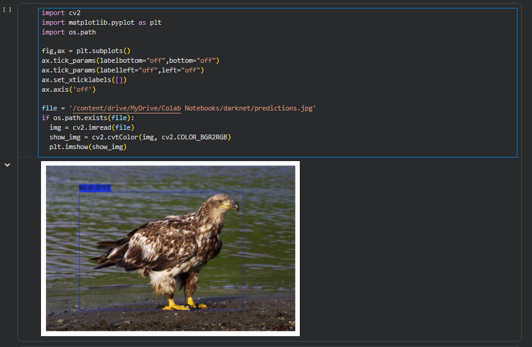
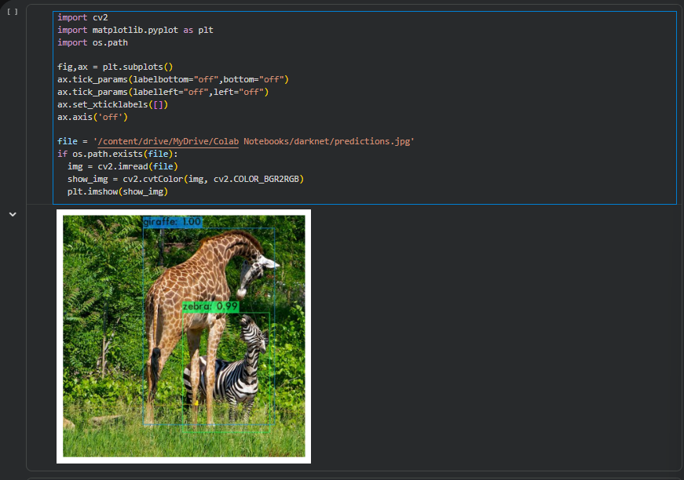
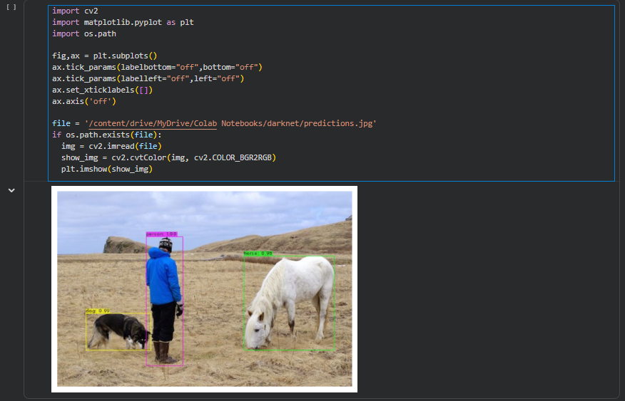
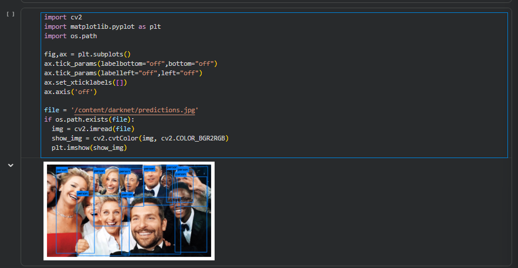

# Object Detection using YOLOv1 and Tiny-YOLO

## Overview

This project demonstrates object detection using YOLOv1 and Tiny-YOLO implemented in Google Colab using Darknet and OpenCV.

The objective of this project is to explore deep learning-based object detection techniques and evaluate model performance on various images.

## Features

- YOLOv1 Object Detection
- Tiny-YOLO Object Detection
- Custom Image Testing
- Bounding Box Visualization
- Detection Confidence Scores
- Google Colab Implementation

## Technologies Used

- Python
- Google Colab
- Darknet
- OpenCV
- YOLOv1
- Tiny-YOLO

## Sample Detection Results

Results include detection of:
## Sample Detection Results

### Bird Detection

### Girrafe and Zebra Detection

### Person, Dog and Horse Detection

### Crowd Person Detection

## Skills Demonstrated

- Computer Vision
- Deep Learning
- Object Detection
- Model Inference
- Python Programming
- OpenCV

## Learning Outcomes

Through this project, I gained practical experience in:

- Deep Learning Fundamentals
- Object Detection using YOLO
- Computer Vision Applications
- Model Inference and Evaluation
- OpenCV Image Processing
- Google Colab Environment
- Darknet Framework

## Future Improvements

- Train YOLO on custom datasets
- Real-time webcam detection
- Performance comparison with YOLOv8
- Edge deployment on embedded devices

## Author

Mohammad Farihin Roslan  
Bachelor of Computer Science (Intelligent Machine)  
Universiti Kebangsaan Malaysia (UKM)
